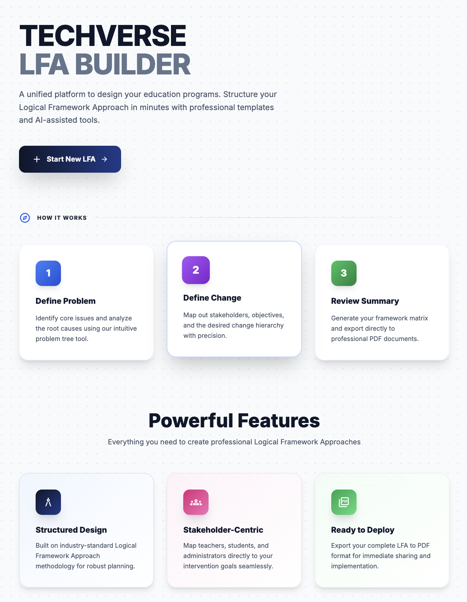
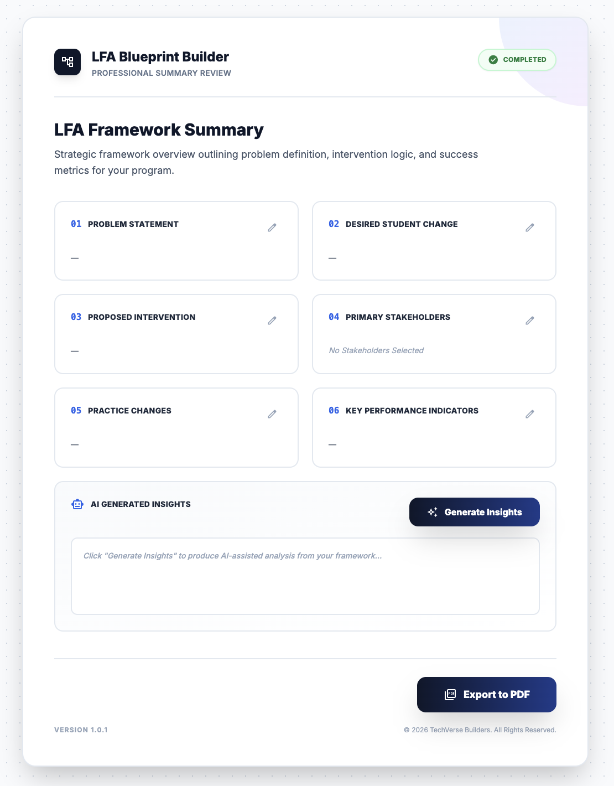

# LFA Builder (Logical Framework Approach Builder)

LFA Builder is a lightweight, web-based tool designed to help education practitioners, policymakers, and program designers create a **Logical Framework Approach (LFA)** step by step. The platform guides users through defining problems, mapping stakeholders, planning interventions, and finally generating **AI-assisted insights** using Google Gemini.

This project was built with a **simple HTML + JavaScript frontend** and a **Node.js + Express backend**, making it easy to understand, extend, and deploy.

---

## ✨ Key Features

* Step-by-step LFA creation (Problem → Change → Intervention → Stakeholders → KPIs)
* Clean, modern UI using Tailwind CSS (via CDN)
* Persistent progress using browser session storage
* AI-generated insights powered by **Google Gemini**
* Export-ready summary page (print to PDF)
* No frontend build tools or frameworks required

---

## 🏗️ Project Structure

```
LFA-Builder/
├── backend/
│   ├── server.js          # Express server + Gemini integration
│   ├── package.json       # Backend dependencies
│   ├── package-lock.json
│   ├── node_modules/      # Generated after npm install (not committed)
│   └── .env               # Environment variables (you create this)
│
├── frontend/
│   ├── js/
│   │   └── toggletheme.js # Theme toggle functionality
│   └── pages/
│       ├── Home.html      # Landing page
│       ├── Step_1.html    # Problem definition
│       ├── Step_2.html    # Desired change
│       ├── Step_3.html    # Intervention planning
│       ├── Step_4.html    # Stakeholder mapping
│       ├── Step_5.html    # KPI definition
│       ├── Step_6.html    # Review & finalize
│       └── Summary.html   # Final summary with AI insights
│
├── assets/
│   └── screenshots/       # Project screenshots for documentation
│       ├── Home.png
│       ├── Step-1.png
│       ├── Step-4.png
│       └── Summary.png
│
├── .gitignore
└── README.md
```

---

## 🔧 Prerequisites

Before running the project, ensure you have:

* **Node.js** (v18+ recommended)
* **npm** (comes with Node.js)
* A **Google Gemini API Key** ([Get one here](https://makersuite.google.com/app/apikey))

---

## 🚀 How to Run the Project Locally

Follow these steps carefully.

### 1️⃣ Clone the Repository

```bash
git clone https://github.com/vaibhavs-h/LFA-Builder.git
cd LFA-Builder
```

---

### 2️⃣ Setup Environment Variables

Navigate to the backend folder:

```bash
cd backend
```

Create a `.env` file inside `backend/` and add your Gemini API key:

```env
GOOGLE_API_KEY=your_gemini_api_key_here
```

> ⚠️ Important: Do **not** commit this file to GitHub.

---

### 3️⃣ Install Backend Dependencies

From inside the `backend` directory, install the required dependencies:

```bash
npm install
```

If `package.json` doesn't exist, initialize it first:

```bash
npm init -y
npm install express cors dotenv @google/generative-ai
```

This will generate the `node_modules` folder and install all required packages.

---

### 4️⃣ Start the Backend Server

Still inside the `backend` folder, run:

```bash
node server.js
```

If successful, you should see:

```
✅ Server running on http://localhost:3000
```

The backend is now ready to handle AI requests.

---

### 5️⃣ Run the Frontend

The frontend does **not** require Node.js or any build step.

Simply:

1. Navigate to:
   ```
   frontend/pages/
   ```

2. Open **Home.html** in your browser (double-click or right-click → Open with browser)

That's it 🎉

**Alternative:** Use Live Server extension in VS Code for hot-reload during development.

---

## 🤖 AI Insights (How It Works)

* All user inputs are stored temporarily in the browser (sessionStorage)
* On the **Summary** page, clicking **"Generate Insights"** sends the LFA data to:
  ```
  POST http://localhost:3000/generate-insights
  ```
* The backend formats a structured prompt and sends it to **Google Gemini**
* The response is returned and rendered directly on the Summary page

No API keys are exposed on the frontend.

---

## 🖨️ Exporting to PDF

The **Summary page** is designed to be printed or exported as a PDF with its visual styling intact.

### Important: Enable Background Graphics

When exporting to PDF:

1. Open the **Summary** page
2. Press **Ctrl + P** (or **Cmd + P** on macOS)
3. Open **More settings** in the print dialog
4. ✅ Enable **Background graphics**

This ensures:

* Background colors
* Gradient sections
* Visual layout styles

are correctly applied to the exported PDF.

The print layout is optimized for **A4 landscape** format.

---

## 📸 Screenshots

### Home Page


### Step 1 - Problem Definition


### Step 4 - Stakeholder Mapping


### Summary with AI Insights


---

## 🧪 Notes & Limitations

* Data persists only for the active browser session (not saved to database)
* Backend must be running for AI generation to work
* Designed for local use or simple deployments (Render / Railway)
* Session storage is cleared when browser/tab is closed

---

## 🌍 Deployment (Optional)

### Frontend Deployment
* **GitHub Pages**: Push `frontend/` folder
* **Netlify**: Drag and drop `frontend/` folder
* **Vercel**: Connect repository and set root to `frontend/`

### Backend Deployment
* **Render**: Connect repository, set root to `backend/`, add environment variable
* **Railway**: Same as Render
* **AWS EC2**: Deploy as Node.js application

**Important:** Make sure to configure the environment variable `GOOGLE_API_KEY` on the backend host.

Update the API endpoint in frontend pages when deploying:
```javascript
// Change from
const response = await fetch('http://localhost:3000/generate-insights', {

// To
const response = await fetch('https://your-backend-url.com/generate-insights', {
```

---

## 🛠️ Tech Stack

**Frontend:**
* HTML5
* Tailwind CSS (CDN)
* Vanilla JavaScript
* Session Storage API

**Backend:**
* Node.js
* Express.js
* Google Generative AI (Gemini)
* CORS
* dotenv

---

## 📝 Project Workflow

1. **Home Page** → Introduction to LFA Builder
2. **Step 1** → Define the problem you want to address
3. **Step 2** → Describe the desired change/outcome
4. **Step 3** → Plan your intervention strategy
5. **Step 4** → Map stakeholders and their roles
6. **Step 5** → Define Key Performance Indicators
7. **Step 6** → Review all inputs
8. **Summary** → View complete LFA + Generate AI insights

---

## 🤝 Contributing

Contributions are welcome! Please feel free to submit a Pull Request.

1. Fork the project
2. Create your feature branch (`git checkout -b feature/AmazingFeature`)
3. Commit your changes (`git commit -m 'Add some AmazingFeature'`)
4. Push to the branch (`git push origin feature/AmazingFeature`)
5. Open a Pull Request

---

## 📄 License

This project is open-source and intended for educational and hackathon use.

---

## 🙌 Acknowledgements

* [Google Gemini API](https://ai.google.dev/)
* [Tailwind CSS](https://tailwindcss.com/)
* Education practitioners using Logical Framework Approaches
* Open-source community

---

## 📧 Contact

**Vaibhav**
* GitHub: [@vaibhavs-h](https://github.com/vaibhavs-h)
* Project Link: [https://github.com/vaibhavs-h/LFA-Builder](https://github.com/vaibhavs-h/LFA-Builder)

---

⭐ **If you found this project helpful, please consider giving it a star on GitHub!** ⭐  
👤 A follow would be much appreciated and helps support future improvements.

---

**Enjoy building your Logical Framework 🚀**